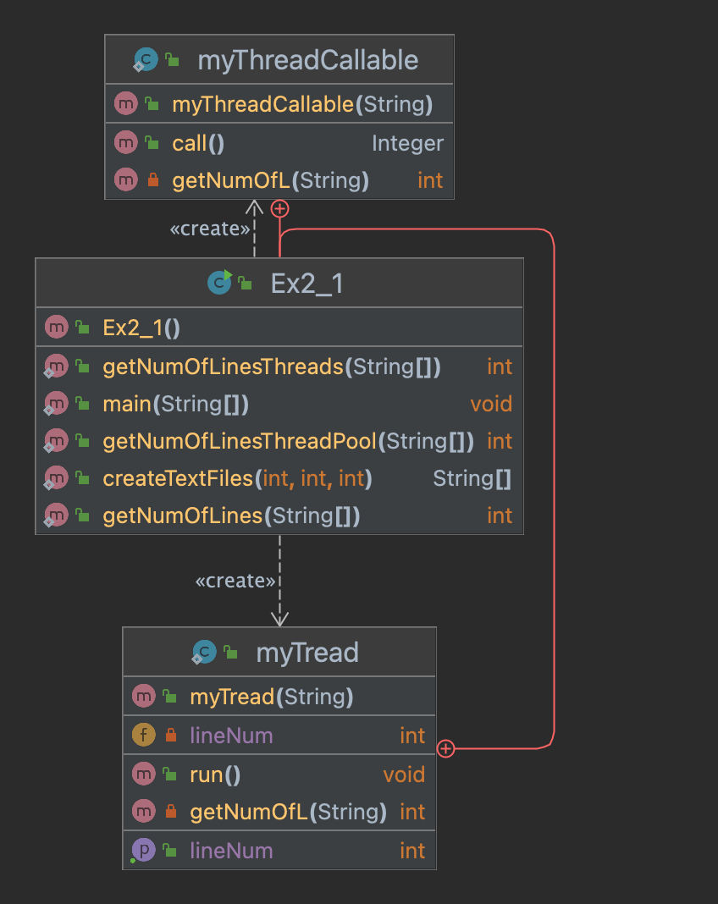

# Object-Oriented Assignment 2

## Description

in this project we can see the diffrent in runing a progrem using a naormal run,threads and thread pool.
we will show the time difrence between counting lines in a groop of files that we creats, and print the times 
for each function (normal,thread,poolthread).


## Time Research

### The Time's Resulte.

First test [files = 10,cead = 10,bound = 100}


   *  method 1:(System.currentTimeMillis())

            Elapsed Time in milli seconds(normal): 17

            Elapsed Time in milli seconds(thread): 10

            Elapsed Time in milli seconds(threadPool): 3

   *  method 2:(Instant.now())

            Elapsed Time in milli seconds(normal): 1

            Elapsed Time in milli seconds(thread): 2

            Elapsed Time in milli seconds(threadpool): 1

 <p align="center">([bound = 1000])</p>
 

   *  method 1:(System.currentTimeMillis())

            Elapsed Time in milli seconds(normal): 26

            Elapsed Time in milli seconds(thread): 8

            Elapsed Time in milli seconds(threadPool): 19

   *  method 2:(Instant.now())

            Elapsed Time in milli seconds(normal): 3

            Elapsed Time in milli seconds(thread): 3

            Elapsed Time in milli seconds(threadpool): 4


 <p align="center">([bound = 10000])</p>

   *  method 1:(System.currentTimeMillis())

            Elapsed Time in milli seconds(normal): 59

            Elapsed Time in milli seconds(thread): 29

            Elapsed Time in milli seconds(threadPool): 10

   *  method 2:(Instant.now())

            Elapsed Time in milli seconds(normal): 14

            Elapsed Time in milli seconds(thread): 6

            Elapsed Time in milli seconds(threadpool): 7


Second test [files = 100,cead = 10,bound = 100}:

   *  method 1:(System.currentTimeMillis())

            Elapsed Time in milli seconds(normal): 38

            Elapsed Time in milli seconds(thread): 32

            Elapsed Time in milli seconds(threadPool): 14

   *  method 2:(Instant.now())_

            Elapsed Time in milli seconds(normal): 6

            Elapsed Time in milli seconds(thread): 12

            Elapsed Time in milli seconds(threadpool): 9

 <p align="center">([files = 1000])</p>

   *  method 1:(System.currentTimeMillis())

            Elapsed Time in milli seconds(normal): 100

            Elapsed Time in milli seconds(thread): 91

            Elapsed Time in milli seconds(threadPool): 122

   *  method 2:(Instant.now())

            Elapsed Time in milli seconds(normal): 36

            Elapsed Time in milli seconds(thread): 56

            Elapsed Time in milli seconds(threadpool): 82

 <p align="center">([files = 3000])</p>

   *  method 1:(System.currentTimeMillis())_

            Elapsed Time in milli seconds(normal): 216

            Elapsed Time in milli seconds(thread): 178

            Elapsed Time in milli seconds(threadPool): 563

   *   method 2:(Instant.now())

            Elapsed Time in milli seconds(normal): 142

            Elapsed Time in milli seconds(thread): 164

            Elapsed Time in milli seconds(threadpool): 470

Third test: (3000,10,100000).

_method 1:(System.currentTimeMillis())_

      Elapsed Time in milli seconds(normal): 25657

      Elapsed Time in milli seconds(thread): 4213

      Elapsed Time in milli seconds(threadPool): 4854

_method 2:(Instant.now())_

      Elapsed Time in milli seconds(normal): 26690

      Elapsed Time in milli seconds(thread): 5288

      Elapsed Time in milli seconds(threadpool): 5759
      
      
## Findings

   as we can see we did 3 tests, the first was low num of files (10) and we increase the bounds 3 times.
   
   we find:
   * When the number of bounds is close to the num of files, we see in general that the ordre is threadpoll
    is the fastest after that thread and last Normal. the reason to it is that creating and destroying threads has a high CPU       usage, so when you need to perform lots of small, simple tasks concurrently the overhead of creating your own threads can       take up a significant portion of the CPU cycles and severely affect the final response time. This is especially true in         stress conditions where executing multiple threads can push CPU to 100% and most of the time would be wasted in context         switching (swapping threads in and out of the processor along with their memory).
    the thread pool however work's a bit diffrent, where a number of threads are created ahead of time and kept around to pick       up any work items you give them to do, without the overhead associated with creating your own threads.
    So when we creates a small numbers of file and a much higher number of lines we can see the diffrenes between the threadpool     to the make a thread for every file. (cuz we still makeing a small num of thread anyway)
   * But if the numbers of line is small comper to the files we can see that even the normal sometimes its the better choice,
     if we looking at threadpool vs thread then theard wins because we got a limited number of thread (4000 in my pool)
     when the queue of task is getting close to the number of thread in pool because the number of lines is small a lot of the        thraed working in parallel and its delaying the pool.
     
# Diagram



   
  


 
 
 


 
 


## Help

Qwick way to delet file.
* make sure you are in the files directory.
* Then open terminal and use the nexxt comend:
```
rm *.txt
```

## Authors

@Moshe nahshon

## Version History

* 0.2
    * Various bug fixes and optimizations
    * See [commit change]() or See [release history]()
* 0.1
    * Initial Release

## License

This project is licensed under the [NAME HERE] License - see the LICENSE.md file for details

## Acknowledgments

Inspiration, code snippets, etc.
* [awesome-readme](https://github.com/matiassingers/awesome-readme)
* [PurpleBooth](https://gist.github.com/PurpleBooth/109311bb0361f32d87a2)
* [dbader](https://github.com/dbader/readme-template)
* [zenorocha](https://gist.github.com/zenorocha/4526327)
* [fvcproductions](https://gist.github.com/fvcproductions/1bfc2d4aecb01a834b46)
