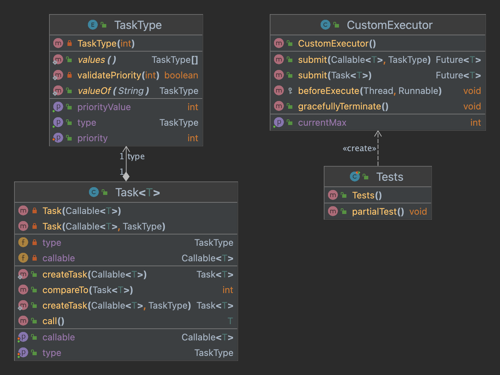

# Object-Oriented Assignment 2 part 1

We created a custome thread pool that can get asynchronous tasks with a priority dimention.

## Description

we created two classes:

1. Class with generic task with a Type that returns a result and may throw an exception.
   Extends FutuerTask and  implements Comparable, Callable.  
   Each task has a priority used for scheduling, inferred from the integer value of the task's Type.

2. Class with custom thread pool that defines a method for submitting a generic task as described in
   the section 1 to a priority queue, and a method for submitting a generic task created by a
   Callable<V> and a Type, passed as arguments.
   Extends ThreadPoolExecutor.

## Getting Started

### Task class
   
 This class, named "Task," represents a task that can be executed by a Java ThreadPollExecutor.
 The class is generic and can be used with any type of result. It extends the "FutureTask" class, 
 which is a class that can be used to represent the result of an asynchronous computation. 
 The "Task" class also implements the "Comparable" and "Callable" interfaces.

The "Task" class has two main purposes:

1. To encapsulate a "Callable" task and add a type to it, where the type is an enumeration called "TaskType" and is used to indicate the priority of the task.
2. To allow the tasks to be compared based on their priority value, so that they can be ordered in a PriorityQueue.
   
The "Task" class has several constructors and static factory methods to create tasks:

1. The first private constructor, which receives a "Callable" task and a "TaskType" as parameters, is used to create a task with a specific priority type.
2. The second private constructor, which receives only a "Callable" task, is used to create a task with the default priority type "COMPUTATIONAL."
3. Two static factory methods, "createTask(Callable<T> task, TaskType type)" and "createTask(Callable<T> task)" which use the private constructors to       create the tasks.
   
Additionally, the class overrides the "compareTo" method of the "Comparable" interface, to allow the tasks to be compared based on their priority value.
And also the class implements "call()" method of the "Callable" interface to allow the tasks to be able to compute a result and throw an exception if unable to do so.

In Summary, This class is allow user to create task with certain priority and also allow user to compare tasks by its priority and execute them by the implemented call method .

### CustomExecutor class

This CustomExecutor class is a custom implementation of the ThreadPoolExecutor class in Java,
which is a type of Executor that manages a pool of worker threads.
The CustomExecutor class overrides the ThreadPoolExecutor class to add additional features and
functionality to suit the needs of the application.

The core functionality of this custom executor is implemented in the submit() method,
which takes a Callable task and a task type (which represents the priority of the task) as parameters. 
The method first updates the priority counters based on the task type and then creates a task using the Task.
createTask() method. This task is then added to the priority queue and executed by the ThreadPoolExecutor.

The beforeExecute() method is called by the ThreadPoolExecutor before executing a task,
and it updates the priority counters based on the task type, as the task is removed from the queue after execution.
This way we can keep track on the highest priority task we have in the qeueu.

The getCurrentMax() method returns the most high-priority task in the queue by checking the priority counters.
   
The gracefullyTerminate() method is used to stop all the tasks and wait for the completion of the tasks that are
already running.
The method first calls the shutdown() method and then waits for the tasks to complete execution with a timeout of 2000ms.
If the timeout elapses and the executor has not terminated, the shutdownNow() method is called to stop all actively 
executing tasks and returns a list of the tasks that were undone.

With this implementation, the CustomExecutor can be used in a scenario
where there are a large number of tasks that need to be executed concurrently
and the order of execution is based on the priority of the tasks.
The CustomExecutor uses a priority queue for its tasks and it uses a fixed size
thread pool to work on these tasks concurrently.
The queue determines the order of execution of these tasks.
This way we can make sure that the high priority tasks are executed before the low priority ones.

### Diagram

## Authors

@Moshe nahshon

@Yogev Ofir

